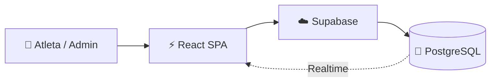

<div align="center">


</div>

<div align="center">

### ⚽ O Sistema Operacional para Complexos Esportivos

_Gestão inteligente, agendamento instantâneo e fim do caos no WhatsApp._

<br/>


<br/>
<br/>


<br/>
<br/>

[](https://arenasys.com.br)
[](https://github.com/RafalauriSantos/arena-sports)

</div>

<br/>

---

## 📑 Índice

- [O que é o ArenaSys](#-o-que-é-o-arenasys)
- [Arquitetura & Diferenciais](#-arquitetura--diferenciais)
- [Recursos Implementados](#️-recursos-implementados)
- [Estrutura do Projeto](#️-estrutura-do-projeto)
- [Rotas da Aplicação](#️-rotas-da-aplicação)
- [Stack Técnica](#-stack-técnica)
- [Guia de Desenvolvimento](#-guia-de-desenvolvimento)
- [Supabase & Backend](#️-supabase--backend)
- [Deploy](#-deploy)
- [Segurança & Performance](#-segurança--performance)
- [Checklist de Produção](#-checklist-de-produção)
- [Licença](#-licença)

---

## 💡 O que é o ArenaSys

O ArenaSys é uma **plataforma SaaS de gestão e agendamento** para complexos esportivos (quadras, arenas, society). Centraliza a agenda em um único lugar: o dono da arena configura quadras e preços; o jogador acessa pelo link, vê horários disponíveis e reserva em segundos — sem WhatsApp, sem caderno, sem conflito de horário.

**O que é:** SaaS **Multi-tenant (B2B2C)**. Cada arena tem seu espaço isolado com link próprio (`/agendar/:subdomain`). Reserva em **menos de 30 segundos**, sem cadastro obrigatório. O pagamento continua no balcão, como o dono prefere.

### Como funciona

1. **Cadastre** — quadras, horários e preços (~15 min)
2. **Compartilhe o link** — cliente vê disponibilidade e reserva sozinho
3. **Confirme e cobre** — no balcão, como sempre

### Para quem

| 🏢 Arena (Admin)                                                                  | ⚽ Jogador                                          |
| :-------------------------------------------------------------------------------- | :-------------------------------------------------- |
| Dashboard com KPIs em tempo real (faturamento, reservas, ocupação, cancelamentos) | Link único por arena · vê disponibilidade 24h       |
| Gráfico de faturamento semanal · próximas reservas                                | Seleciona quadra · calendário com horários e preços |
| Múltiplas quadras (Society, Futsal, etc.) · preços por horário                    | Status por slot: disponível, reservado, lotado      |
| Bloqueio de horários (Mensalistas)                                                | Histórico de jogos · convites · PWA instalável      |
| Dados 100% isolados por tenant                                                    | Sem cadastro obrigatório                            |

---

## 🧠 Arquitetura & Diferenciais

<p align="center">
  
  
  
</p>

Stack serverless focada em performance e isolamento de dados.

### 1. Performance "Piscar de Olhos" (Optimistic UI)

> **Desafio:** Usuários abandonam o agendamento se a tela demorar a carregar.  
> **Solução:** **React Query** com _Optimistic Updates_. Interface responde instantaneamente; sincroniza em background. Redução de **~40%** no tempo de percepção de latência (~2s → ~1.2s).

### 2. Segurança Bancária (RLS)

> **Desafio:** "Arena A" não pode ver dados da "Arena B" no mesmo banco.  
> **Solução:** **Row Level Security** no PostgreSQL. Isolamento no banco, não apenas no app. Frontend comprometido não expõe dados de outros tenants.

### Fluxo de Dados



---

## ⚙️ Recursos Implementados

**Admin:** Login · Dashboard com KPIs e gráficos em tempo real · múltiplas quadras e preços dinâmicos · mensalistas (bloqueios recorrentes) · notificações in-app.

**Jogador:** Agenda pública por link · calendário com horários/preços/status · reserva sem login · histórico · PWA instalável.

**Geral:** Roteamento por perfil · SEO com metatags dinâmicas · landing com mockups e animações.

**Roadmap:** Performance e segurança (Fev 2026) ✅ · Próximos: notificações WhatsApp, IA para horários de pico.

---

## 🗂️ Estrutura do Projeto

```
arena-sports/
├── src/
│   ├── pages/           # Páginas e rotas
│   │   ├── admin/       # Painel administrativo (Dashboard, Agenda, Financeiro, etc.)
│   │   ├── Landing.tsx  # Landing page
│   │   ├── Login.tsx
│   │   ├── BookingPublic.tsx  # Agenda pública (/agendar/:subdomain)
│   │   └── ...
│   ├── components/      # Componentes reutilizáveis
│   │   ├── admin/       # Componentes do painel (TrialBanner, SlotDetailsModal, etc.)
│   │   ├── ui/          # Design system (Radix UI + Tailwind)
│   │   └── ...
│   ├── contexts/        # AuthContext, BookingsContext
│   ├── hooks/           # useSettings, useSubscriptionAccess, useTrialStatus, etc.
│   ├── lib/             # supabaseClient, edgeFunctions, utils
│   └── config/          # Configurações
├── supabase/
│   ├── migrations/      # Migrations SQL (RLS, tabelas, funções RPC)
│   └── config.toml
└── scripts/             # Testes, deploy, auditorias
```

---

## 🛣️ Rotas da Aplicação

| Rota                                                                             | Descrição                                                        |
| :------------------------------------------------------------------------------- | :--------------------------------------------------------------- |
| `/`                                                                              | Landing page                                                     |
| `/login`                                                                         | Login e cadastro                                                 |
| `/welcome`                                                                       | Onboarding pós-cadastro                                          |
| `/agendar/:subdomain`                                                            | **Agenda pública** — link único por arena (jogador reserva aqui) |
| `/dashboard`                                                                     | Painel admin (redireciona)                                       |
| `/dashboard/dashboard`                                                           | Visão Geral — KPIs, gráficos, próximas reservas (rota base)      |
| `/dashboard/agenda`                                                              | Reservas — agenda master, criar reservas                         |
| `/dashboard/financeiro`                                                          | Financeiro — faturamento, relatórios                             |
| `/dashboard/mensalistas`                                                         | Mensalistas — bloqueios recorrentes                              |
| `/dashboard/folgas`                                                              | Gerenciar folgas e horários especiais                            |
| `/dashboard/configuracoes`                                                       | Configurações da arena (quadras, horários, preços)               |
| `/privacy` · `/terms` · `/support` · `/about`                                    | Páginas institucionais                                           |
| `/software-quadras-futebol` · `/sistema-beach-tennis` · `/gestao-quadra-society` | Páginas SEO                                                      |
| `/blog` · `/blog/:slug`                                                          | Blog                                                             |

---

## 🔧 Stack Técnica

| Categoria          | Tecnologias                                              |
| :----------------- | :------------------------------------------------------- |
| **Frontend**       | React 18 · TypeScript · Vite 7 · Tailwind CSS            |
| **Estado & Dados** | React Query (TanStack) · React Hook Form · Zod           |
| **UI**             | Radix UI · Lucide Icons · Framer Motion · Recharts       |
| **Backend**        | Supabase (PostgreSQL · Auth · Realtime · Edge Functions) |
| **PWA**            | vite-plugin-pwa                                          |
| **Runtime**        | Bun (recomendado) ou Node 18+                            |

---

## 🚀 Guia de Desenvolvimento

<p align="center">
  
</p>

> Use **Bun** para instalação e build (até 3x mais rápido que npm).

### Pré-requisitos

- **Bun** (recomendado) ou Node.js 18+
- **Git**
- Conta no **Supabase** (projeto criado)

### Instalação

```bash
# Clone o repositório
git clone https://github.com/RafalauriSantos/arena-sports.git
cd arena-sports

# Instale as dependências
bun install

# Configure as variáveis de ambiente
# Crie .env.local na raiz (veja seção "Variáveis de Ambiente" abaixo)
```

### Variáveis de Ambiente

Crie `.env.local` na raiz:

```env
# Supabase (obrigatório)
VITE_SUPABASE_URL=your_supabase_url
VITE_SUPABASE_ANON_KEY=your_supabase_anon_key

# Supabase (apenas para Edge Functions - NUNCA use VITE_)
SUPABASE_SERVICE_ROLE_KEY=your_service_role_key
```

> A `SUPABASE_SERVICE_ROLE_KEY` não pode ir para o browser. Configure como secret nas Edge Functions.

### Comandos

```bash
# Desenvolvimento (HMR)
bun dev
# Abra a URL exibida no terminal (ex.: http://localhost:5000)

# Build para produção
bun run build

# Preview da build
bun run preview
```

### Testes

```bash
# Suite completa
bun run test

# Fluxo completo (cadastro → onboarding)
bun run test:flow

# Isolamento multi-tenant
bun run test:tenant-isolation
```

### Banco de Dados

```bash
# Aplicar migrations
npx supabase@latest db push

# Reset local (desenvolvimento)
npx supabase@latest db reset

# Status das migrations
npx supabase@latest migration list
```

### Scripts Disponíveis

> **Para recrutador:** suite de testes cobrindo fluxo crítico (cadastro → onboarding), isolamento multi-tenant e conectividade.

| Script                          | Descrição                                |
| :------------------------------ | :--------------------------------------- |
| `bun dev`                       | Servidor de desenvolvimento (porta 5000) |
| `bun run build`                 | Build para produção                      |
| `bun run preview`               | Preview da build                         |
| `bun run test`                  | Suite completa de testes                 |
| `bun run test:flow`             | Fluxo cadastro → onboarding              |
| `bun run test:tenant-isolation` | Validação de isolamento multi-tenant     |
| `bun run audit:perf`            | Auditoria de performance                 |
| `bun run audit:seo`             | Auditoria de SEO                         |
| `bun run check:deploy`          | Checklist pré-deploy                     |
| `bun run db:push`               | Aplicar migrations no Supabase           |
| `bun run db:reset`              | Reset do banco local                     |
| `bun run db:list`               | Listar migrations                        |
| `bun run lint`                  | ESLint                                   |

---

## 🗄️ Supabase & Backend

- **PostgreSQL** — RLS em todas as tabelas críticas; isolamento por tenant no banco
- **Realtime** — atualizações em tempo real (reservas, ocupação)
- **Auth** — email + senha
- **Migrations** — histórico de evolução em `supabase/migrations/` (estrutura, RLS, otimizações)

---

## 🚀 Deploy

<p align="center">
  
</p>

### Vercel

1. Conecte o repositório no Vercel
2. Configure as variáveis de ambiente
3. Deploy automático a cada push na `main`

### Pós-Deploy

1. Configure domínio personalizado
2. Teste fluxo completo em produção
3. Monitore logs das Edge Functions

---

## 🔒 Segurança & Performance

**Performance:** Carregamento ~40% mais rápido (~2s → ~1.2s) · Queries -60% · Banda -30% · Logs de debug desativados em prod.

**Segurança:** RLS validado · Funções RPC com filtro por subdomain · Isolamento completo entre tenants. Detalhes em [PERFORMANCE_IMPROVEMENTS.md](PERFORMANCE_IMPROVEMENTS.md) e [`docs/`](docs/).

---

## 📋 Checklist de Produção

- [ ] Todos os testes passando
- [ ] Migrations aplicadas no banco remoto
- [ ] Secrets configurados (Supabase)
- [ ] Build e preview sem erros
- [ ] PWA testado em mobile
- [ ] Isolamento de tenants validado

---

## 📝 Licença

<div align="center">

Este projeto está sob a licença **MIT**.


**Desenvolvido por Rafael Lauri** 🚀

</div>
